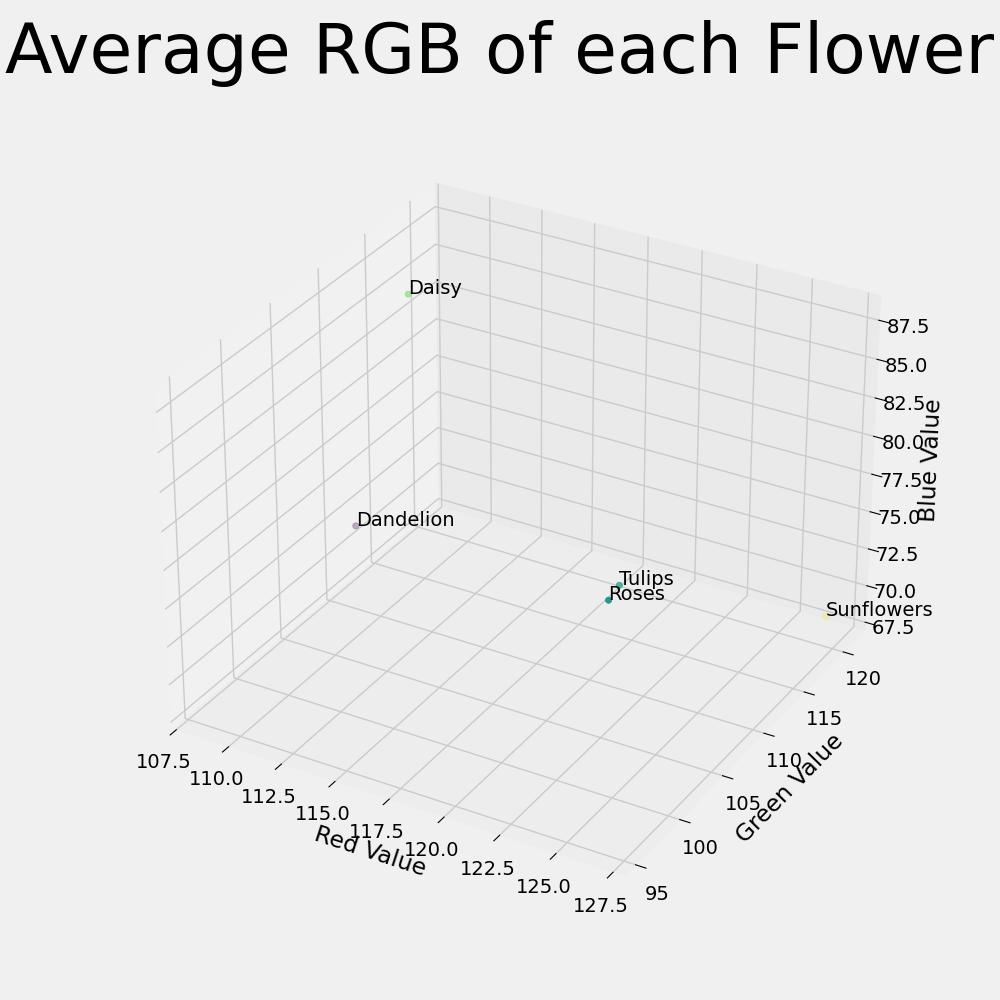

# My Flower Classification App
**The Web Application is live at:** https://myflowerclassificationapp.streamlit.app/

### Technologies used
**Programming Language: Python**
**IDE: PyCharm**
The application utilizes a jupyter notebook to create a Machine Learning model, and uses the open-source python framework, streamlit, to host the application.

```
Jupyter Notebook File: FlowerCalssificationNotebook.ipynb
Web App Source Code: webapp.py
```

### Data Summary
The data used for the model was collected from the official TensorFlow dataset catalog labeled "tf_flowers." The link to download the dataset is, https://www.tensorflow.org/datasets/catalog/tf_flowers. The dataset of images was stored in the '/Images' subdirectory of the main project folder and divided into their appropriate labels; daisy, dandelion, roses, sunflowers, and tulips.

### Machine Learning 
A supervised machine-learning method was used. A machine learning image classification model was created to classify a type of plant found in an image. The model was trained on the flower dataset by TensorFlow. The flower dataset contains a mixed collection of 3670 images labeled as daisy, dandelion, rose, sunflower, or tulip.
The method was developed using the Python programming language along with the sci-kit-learn library. For the training and validation of the model, The images where split into an 80/20 split, 80% of the images were used for training and 20% were used for the validation of the machine learning model. This 80/20 split was accomplished when programming the training and validation datasets in Python. By using the Keras library "validation_split" parameter on dataset creation we were able to specify the 80/20 split. 
The method used was able to read images and proved to have an adequate prediction accuracy that we deemed sufficient to complete the task.


### Project details:
The machine learning model is currently only capable of distingushing between the following 5 flowers:
||
|---|
daisy
dandelion
roses
sunflowers
tulips

|Number of images each flower plant has in the dataset|
|---|

|This visualization shows the number of images each plant has in the dataset. This chart helped us identify any plant class imbalances in our dataset. We can see that the dandelion had the highest amount of images in the dataset with 898 images. We can also see that daisy has the minimum amount of images in the dataset with 633 images. Training a machine learning model on an imbalanced dataset may result in outcomes that are biased toward certain plants.|

|Distribution of image sizes in the dataset|
|---|

The distribution of image sizes in the dataset allowed us to gain insight into our dataset. We can see that a vast majority of the images in the dataset had a file size less than 50,000 bytes(0.05MB)

|Average RGB of each Flower|
|---|

For each image in the dataset, we extracted the independent average RGB value over all the pixels, grouped them together per Flower Type, and were able to calculate the average RGB value per plant. This 3D graph shows that Tulips and Roses are really close in color, possibly making it harder for the Machine Learning model to distinguish between one another. Whereas Daisy, Dandelion, and Sunflowers are more spread apart from one another.

|Training and validation accuracy| Training and Validation Loss|
|---|---|
|||

For the machine learning model that was created, a hold-out validation method was used. The dataset that was collected was split into an 80/20 split; 80% of the dataset was used for training the model, and 20% was used for testing. The results of using this validation method show the training accuracy of the model was  75%, and the validation accuracy was 70%. The training loss was 65% and the validation loss was approximately 80%.
